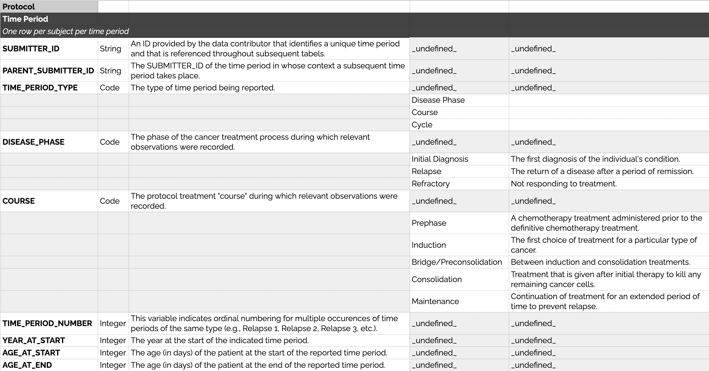

# Longitudinal Reporting in the PCDC Data Model

## Age At
For HIPAA-compliance reasons, the PCDC does not use dates. Dates in the source data are required to be transformed into the age (in days) of the patient at the time of the observation. These AGE_AT variables can be found throughtout the PCDC data model.

## Time Periods
PCDC <i>Time Periods</i> can be used in addition to the age (in days) of the patient. Time periods each have reference IDs, a type, an ordinal number (for multiple occurrences of a single type), the year during which the time period started, and the age in days of the patient at the start and end (where available and relevant). These attributes are shown below as a data dictionary table.

## Example
While they may seem onerous at first glance, time periods are an effective way to order events and observations present in a cancer dataset. Consider the following simplified vignette:

>A 13 month-old patient is diagnosed with neuroblastoma and enrolled on a clinical trial. Her initial imaging shows a primary tumor in the adrenal gland and a metastasis in the liver. Her trial protocol calls for 3 week cycles of induction therapy followed by consolidation therapy. She shows a partial response to the treatment. Relapse is diagnosed a little over 1 year later in one of her lymph nodes. She is given additional cycles of re-induction therapy and subsequent consolidation therapy.

In this vignette, there are two time periods (disease phases) which represent the initial diagnosis and the relapse events. Each of these include two additional time periods (courses) which represent induction and consolidation therapies. These can be visualized as shown below:

                                                                                                
Once declared, these time periods can then be used to organize all of the reported data for the patient. This is done by using reference IDs. A unique ID is declared for each time period and used throughout the rest of the tables in the data model, as shown below:

