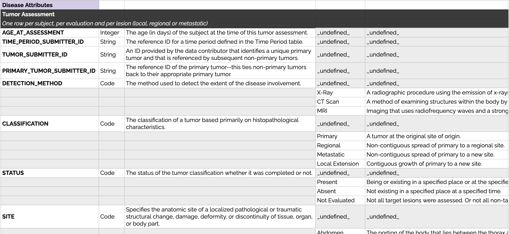
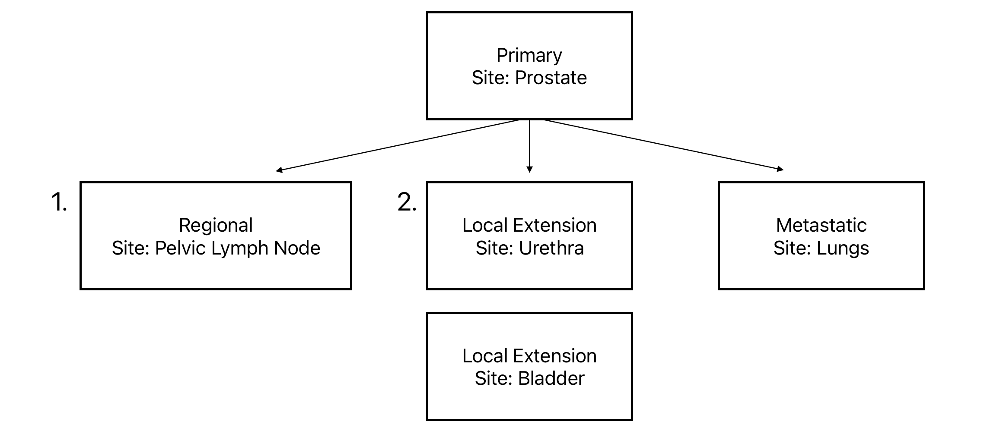

# Tumor Reporting in the PCDC Data Model

## Tumor Assessment
The tumor assessment table can be used to describe all types of tumors associated with the cancer of a patient. These types currently include:

| Classification | Description                                          |
|----------------|------------------------------------------------------|
| Primary | A tumor at the original site of origin.              |
| Regional | Non-contiguous spread of primary to a regional site. |
| Metastatic | Non-contiguous spread of primary to a new site.      |
| Local Extension | Contiguous growth of primary to a new site.          |

Each tumor can have several reported attributes, these are detailed in the data dictionary of each disease group (sample included below).

## Example
While it may seem non-intuitive to separately report primary tumors, regional and/or extension sites, metastases, etc., it prevents the duplication of concepts in the data model. For example, rather than maintaining 4 site variables (primary site, regional site, metastatic site, extension site) we can use the same generic site variable for all tumor classifications. 

Consider these two variations of an example:

> 1. A patient is diagnosed with alveolar rhabdomyosarcoma of the prostate with regional pelvic lymph node involvement and metastatic disease to the chest. 
> 2. A patient is diagnosed with alveolar rhabdomyosarcoma of the prostate with local extension (from the prostate through the urethra and into the bladder) and metastatic disease to the chest.

In the first variation of this example, there are three observations to report: the primary tumor, the regional lymph node involvement, and the lung metastasis.

In the second variation of this example, there are four observations to report: the primary tumor, the local extension to the urethra, the local extension to the bladder, and the lung metastasis.

So, what does reporting tumors this way look like? As it is with any table in the PCDC data model, each observation is reported in separate rows. In order to keep both contiguous and non-contiguous growth to new sites in the context of the primary tumor, reference IDs are used, as shown below:

